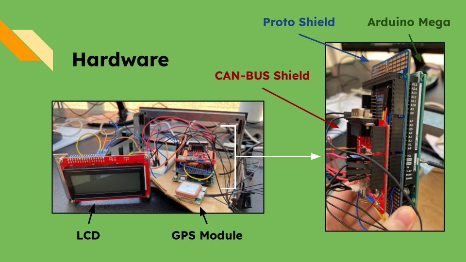
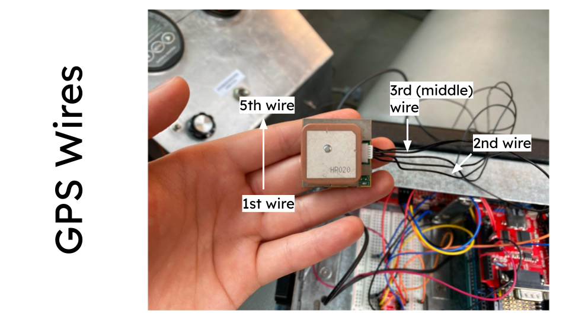

# Welcome!

This is BCC's unofficial EVC Truck repository, where all of the files for instrumentation on the truck are stored.


***

# The File Tree

- `arduino-libraries` contains a couple of the library files used for the Arduino Mega. This is just for reference. Honestly, this might not even be necessary at this point.
- `data` contains the data files of our test runs.
- `docs` contains important documents or manuals.
- `i2c-gps-programs` contains code for the Arduino Mega and UNO to display text on the LCD (using the I2C communication protocol) while getting GPS data (which uses UART serial).
- `imgs` contains images that are displayed on this document.
- `mega` contains code for the Arduino Mega.
    - `canbus123` is the most recent program as of summer 2024 for the truck.
- `test-programs` contains basic programs to demonstrate the basic functionality of the hardware.

***

# Hardware Overview

- The GPS uses the UART serial communication protocol, and the LCD uses I2C.
- The proto shield is used to help with wire management.



## List
- [Electrocookie Mega R3 Proto Shield](https://www.amazon.com/ElectroCookie-Arduino-Prototype-Stackable-Expansion/dp/B0841ZFP1C)
- [Arduino Mega](https://store.arduino.cc/products/arduino-mega-2560-rev3)
- [SparkFun CAN-BUS Shield](https://www.sparkfun.com/products/13262)
- [SparkFun 20x4 SerLCD - RGB Backlight (Qwiic)](https://www.sparkfun.com/products/16398)
- [SparkFun GPS Receiver EM-506](https://www.sparkfun.com/products/retired/12751?gad_source=1)
- [SparkFun Bi-Directional Logic Level Converter](https://www.sparkfun.com/products/12009)
- [Breadboard](https://www.sparkfun.com/products/12002)
- Jumper wires
- [Micro Center 128GB microSD Card](https://www.microcenter.com/product/659122/micro-center-128gb-microsdxc-card-class-10-uhs-i-c10-u1-flash-memory-card-with-adapter)

## Hookup Guidelines

### Connecting the GPS

Plug in the 5-wire connection to the GPS module and to the GPS port on the CAN-BUS Shield. The second and the third wire should be stripped and have male ends soldered onto them, which is shown in the image below:



The two wires should be connected to the appropriate pins:

|GPS Module|Proto Shield (or Mega)|
|---|---|
|Third (middle) wire|Pin 14|
|Second wire|Pin 15|

### Establishing the SD Card Connection

If the prototyping shield isn't being used, the following are the pins you'd connect on the CAN-BUS and the Mega:

| CAN-BUS | Mega |
|---|---|
|10|53|
|13|52|
|11|51|
|12|50|

If the prototyping shield *is* being used, the following are the pins you'd connect with female-to-female jumper wires:

| Proto Shield | Proto Shield |
|---|---|
|10|53|
|13|52|
|11|51|
|12|50|


### Connecting the LCD

Reference this [hookup guide](https://learn.sparkfun.com/tutorials/avr-based-serial-enabled-lcds-hookup-guide/introduction) in general. To hook up the LCD for I2C, see this [part of the hookup guide](https://learn.sparkfun.com/tutorials/avr-based-serial-enabled-lcds-hookup-guide/i2c-hardware-hookup--example-code---basic). Here's the [diagram](https://cdn.sparkfun.com/assets/learn_tutorials/7/8/9/Fritzing_Arduino_SerLCD_I2C_bb.jpg). For some reason, the diagram doesn't include the connections for LCD GND and RAW, so we guessed those.

| LCD | Breadboard | CAN-BUS |
|---|---|---|
|GND|A27||
|RAW|A15||
|SDA|D30 (LV1 on the Logic Level Converter)||
|SCL|D29 (LV2)||
||E16 to -2 (from top right)||
||D28 (LV)|3.3v|
||H28 (HV)|5v|
||-1 (top right)|GND|
||E15|VIN|
||H30 (HV1)|SDA|
||H29 (HV2)|SCL|
||J27 to -27 (from the right)||

Orient the Logic Level Converter as shown in the image below:


***

# Displaying Truck Metrics

|Metric|Working on Display?|Data is From|
|---|---|---|
|Speed (mph)|Y|GPS|
|RPM|N|Motor controller|
|Battery temperature (C)|Y|BMS|
|Motor controller temperature (C)|N|Motor controller|
|Pack current|Y|BMS|
|Pack voltage|Y|BMS|
|Lowest cell voltage|Y|BMS|
|Lowest cell voltage ID|Y|BMS|
|Kilowatt-hour|Y|BMS|
|Trip (miles)|Y|GPS|
|Time|-|-|
|Latitude/Longitude|-|GPS|
|Altitude (meters)|-|GPS|
|Course (degrees)|-|GPS|
|MPGe|-|BMS|
|Power|-|BMS|

## LCD Layout

- (17, 1) is the lowest cell voltage ID
- (14, 2) is the lowest cell voltage

|  | 0 | 1 | 2 | 3 | 4 | 5 | 6 | 7 | 8 | 9 | 10 | 11 | 12 | 13 | 14 | 15 | 16 | 17 | 18 | 19 |
| :---- | :---- | :---- | :---- | :---- | :---- | :---- | :---- | :---- | :---- | :---- | :---- | :---- | :---- | :---- | :---- | :---- | :---- | :---- | :---- | :---- |
| **0** | x | x | . | x | x | M | P | H |  | R | P | M | : | x | x | x | x |  |  |  |
| **1** | B | T | : | x | x | x | C |  | M | C | : | x | x | x | C |  |  | \# | x | x |
| **2** | x | x | x | A |  | x | x | x | . | x | V |  |  |  | x | . | x | x | x | V |
| **3** | x | x | x | . | x | K | W | H |  | T | R | I | P | : | x | x | x | . | x |  |


## Connecting to the Battery Management System (BMS) on Arduino

- In the Arduino code, make sure the baud rates are the same as the BMS via `CANSPEED_125`.
- In order to retrieve metrics from the BMS, the BMS must be set up with the appropriate parameters under a message identifier. Keep in mind certain parameters take up 2 bytes instead of 1. Within the Arduino code, `if` statements catch messages on the CAN bus protocol. By accessing the appropriate byte from the message identifier, we can retrieve the metric we need from the BMS.
    - Take a look at this `if` statement:
        ``` c++
        if (message.id == 0x123) {
            int CDEC = 0; 
            for (int i = 0; i < 2; i++) { // (1)
                int MDATA = (message.data[i]); 
                CDEC = CDEC + (MDATA*(pow(256, 1-i)));
            }
            lcd.setCursor(0,1); 
            lcd.print("BT:");
            lcd.print(message.data[3],DEC); // (2)
            lcd.print("C");
            lcd.setCursor(17,1);
            lcd.print("#");
            lcd.print(message.data[2],DEC); // (3)
            lcd.setCursor(13,2);
            lcd.print((float)CDEC/10000,3); // (4)
            lcd.print("v");
        }
        ```
        - (1) Gets the low cell voltage by checking bytes 0 and 1.
        - (2) Displays the highest battery temperature.
        - (3) Displays the low cell voltage ID.
        - (4) Displays the low cell voltage from (1).
- You'll see some `for` statements that iterate on the same initialization value. This is intentional. Apparently it gets rid of leading zeroes.
- Check the [editing-canbus-messages](./docs/editing-canbus-messages.pdf) document under `docs` for more information.

### CAN Addresses on the BMS

These can be modified on the BMS software.

|0x03B|Byte|Metric|
|---|---|---|
||0|Pack current|
||1||
||2|Pack inst voltage|
||3||
||4||
||5||
||6||
||7||

|0x3CB|Byte|Metric|
|---|---|---|
||0|Pack DCL|
||1|Pack CCL|
||2||
||3|Simulated SOC|
||4|High temperature|
||5|Low temperature|
||6||
||7||

|0x6B0|Byte|Metric|
|---|---|---|
||0||
||1|Pack SOC|
||2|Pack resistance|
||3||
||4|Pack open voltage|
||5||
||6|Pack amphouts|
||7||

|0x123|Byte|Metric|
|---|---|---|
||0|Low cell voltage|
||1||
||2|Low cell voltage ID|
||3|High temperature (battery)|
||4||
||5||
||6||
||7||

***

# Todo

- [ ] Get RPM and motor controller temperature from the motor controller to display on LCD
- [ ] Ensure that the data printed to the SD card is formatted properly
- [ ] Radio or music player capabilities

***

# From the Summer 2024 Team: Need Help?

Maybe we remember or forgot something. We'll do our best to help. :)

- Alex: gutierrezale101@gmail.com
- Fuzail: alifuzail5@gmail.com
- Rebekah: rbkehan@gmail.com